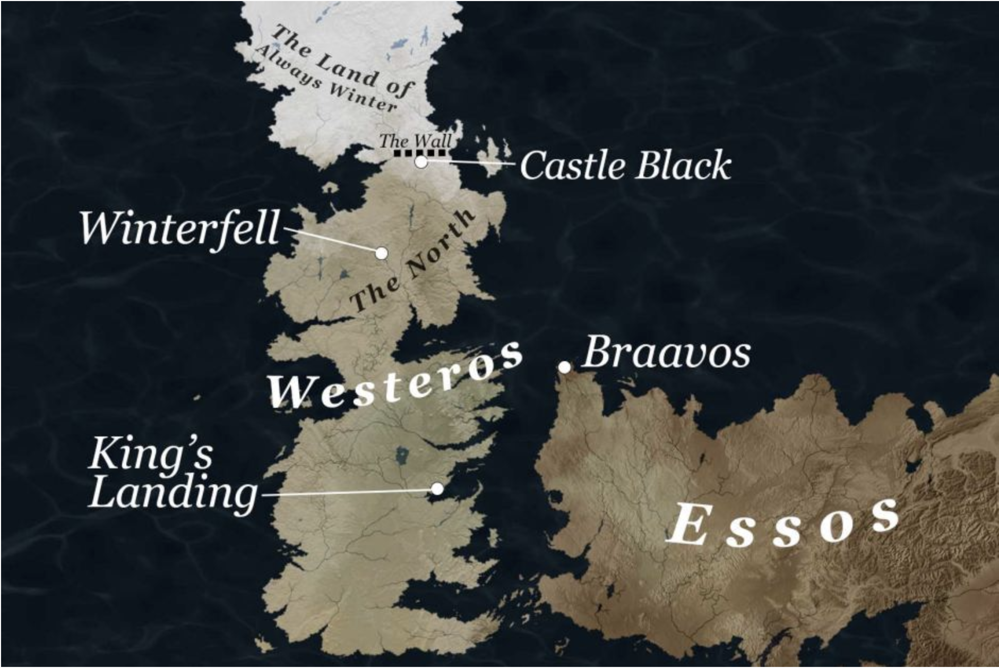
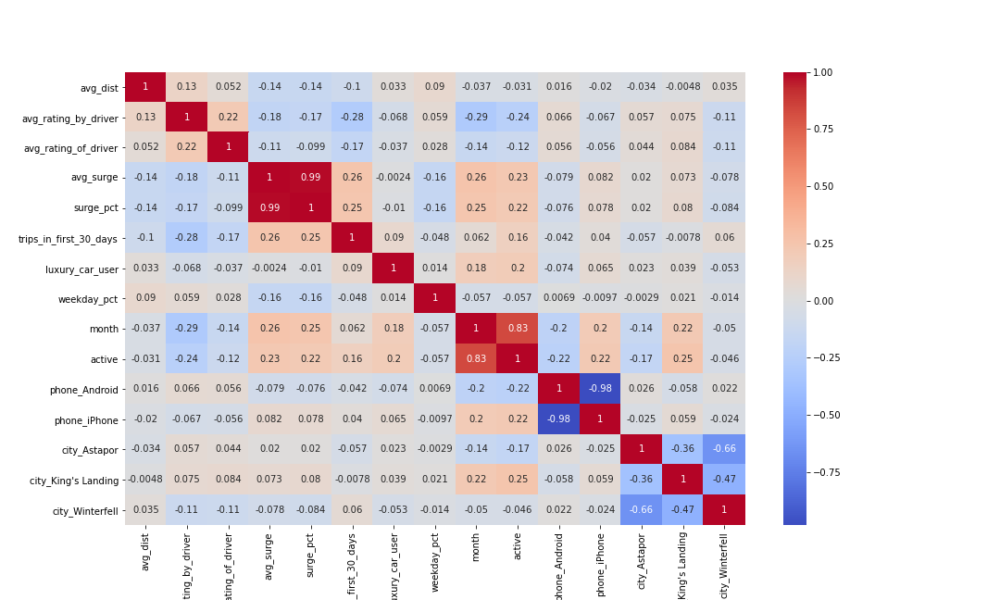
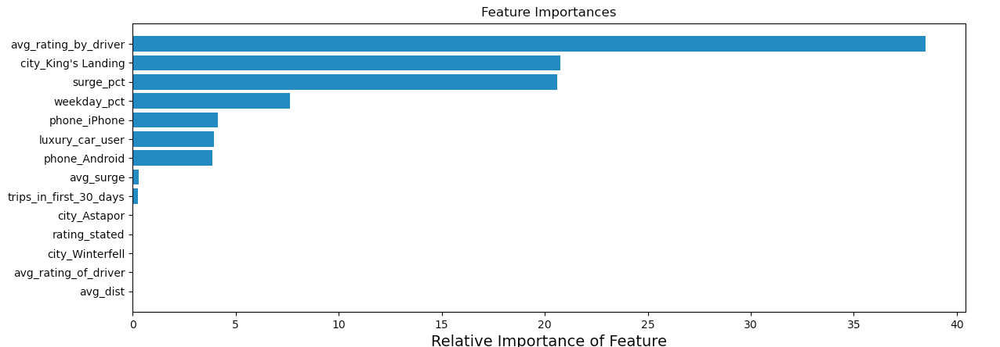

# Churn case Study

# Table of contents

* [EDA](#EDA)
* [Modeling](#Modeling)
* [Results](#Results)
* [Conclusion](#Conclusion)
* [Next Steps](#Next-Steps)

# Background

The data, a collection of users who signed up in January 2014, was pulled on July 1, 2014. We considered a user retained if they were “active” (i.e. took a trip) in the preceding 30 days (from the day the data was pulled). In other words, a user is "active" if they have taken a trip since June 1, 2014.

A presentation including the following points:

* What model did you use in the end? Why?
* Alternative models you considered? Why are they not good enough?
* What performance metric did you use to evaluate the model? Why?
* Based on insights from the model, what plans do you propose to reduce churn?
* What are the potential impacts of implementing these plans or decisions? What performance metrics did you use to evaluate these decisions, why?

hypotheses we had:
1. if rating goes down, maybe will churn
2. if didn't take a trip in february (within first month), maybe they will churn
3. if taking luxury trips maybe not churning
4. people that didn't rate at all more likely to churn

# EDA

* How did we compute the target? 
    * To create the target column we isolated the users that had taken a trip since June 1, 2014 and labeled them as 'active.'
    * Identified 14,595 active users out of 40,000
* Converted phone type and city to dummy variables
* 319 NaN values identified for phone os
* Dropped rows with NaN values for column 'avg_rating_by_driver' because it represented only a small subset of the data
* Ran T-test to determine the effect of NaN values in 'avg_rating_of_driver' on dataset
    * This helps us see if this subset has a different distribution than the rest of the dataset
    * Used average distance column as our comparator
    * t-statistic = -16.601760294457094
    * p-value = 7.626466059905339e-61
    * Given these results, we can reject the null hypothesis. The calculated p-value indicates that our NaN values do have an effect on our overall dataset and therefore decided not to drop these rows but rather replace our NaNs with the mean
* columns created:
    * 'active' - Boolean; True indicates user is active, False indicates user is not active
    * 'rating_stated' - Boolean; True indicates user has avg rating of driver, False indicates user has NaN for avg rating of driver

# Modeling
* Models Explored:
    * Linear Classifier
    * Decision Tree (Classification)
    * Random Forest (Classification)
    * Gradient Boost Classifier

# Results & Interpretation
### Gradient Boosting Classifier
 
Fitting 5 folds for each of 54 candidates, totalling 270 fits
[Parallel(n_jobs=-1)]: Using backend LokyBackend with 8 concurrent workers.
[Parallel(n_jobs=-1)]: Done  34 tasks      | elapsed:   19.6s
[Parallel(n_jobs=-1)]: Done 184 tasks      | elapsed:  3.1min
[Parallel(n_jobs=-1)]: Done 270 out of 270 | elapsed:  5.1min finished

"best parameters" as determined through Grid Search:
* learning_rate': 0.001 
* 'loss': 'deviance' 
* 'max_depth': 2 
* 'max_features': 'auto' 
* 'n_estimators': 1000 
* 'random_state': 1 
* 'subsample': 0.3

#### Gradient Boosting Classifier SCORE with best parameters:  0.989558232931727

### Random Forest Classifier

Fitting 5 folds for each of 16 candidates, totalling 80 fits
[Parallel(n_jobs=-1)]: Using backend LokyBackend with 8 concurrent workers.
[Parallel(n_jobs=-1)]: Done  34 tasks      | elapsed:   10.3s
[Parallel(n_jobs=-1)]: Done  80 out of  80 | elapsed:   25.9s finished

"best parameters" as determined through Grid Search:
* criterion': 'gini'
* 'max_depth': 2
* 'n_estimators': 100
* 'random_state': 1}

#### Random Forest Classifier SCORE with best parameters: 

### Decision Tree Classifier

Fitting 5 folds for each of 32 candidates, totalling 160 fits
[Parallel(n_jobs=-1)]: Using backend LokyBackend with 8 concurrent workers.
[Parallel(n_jobs=-1)]: Done  52 tasks      | elapsed:    0.7s
[Parallel(n_jobs=-1)]: Done 160 out of 160 | elapsed:    1.7s finished

"best parameters" as determined through Grid Search:

* 'criterion': 'gini'
* 'max_depth': 2
* 'max_features': 10
* 'random_state': 1
* 'splitter': 'best'

#### Decision Tree Classifier SCORE with best parameters:

Feature importance:

# Conclusion 

# Next Steps

We needed more time to ROC curve graphics, and feature importance. 
